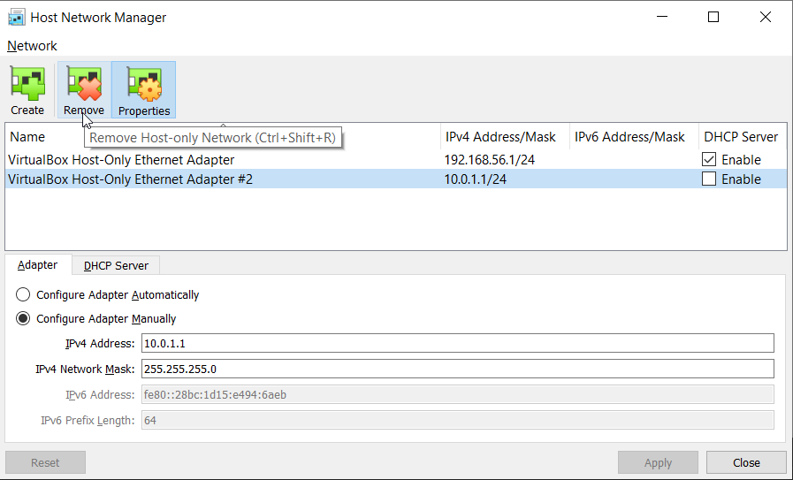

# Test infrastructure

Read (also all sub chapters) to understand:
 * [Vagrant Getting started](https://learn.hashicorp.com/collections/vagrant/getting-started)
 * [Vagrant Mutiple servers](https://www.vagrantup.com/docs/multi-machine)
 * [Vagrant networks](https://www.vagrantup.com/docs/networking)
 * [Helpful example](https://manski.net/2016/09/vagrant-multi-machine-tutorial/)

We will try to simulate a production ready infrastructure. Following, as far as we get without having a enterprise license, the guides on
* [Nomad Reference Architecture](https://learn.hashicorp.com/tutorials/nomad/production-reference-architecture-vm-with-consul?in=nomad/enterprise)
* [Nomad Deployment Guide](https://learn.hashicorp.com/tutorials/nomad/production-deployment-guide-vm-with-consul?in=nomad/enterprise)

Therefore we distinquisch between 3 different types of servers.

## `Jump server`
with the VM ID `nj1.local.jumper.nomad`

From this [jumper server](https://en.wikipedia.org/wiki/Jump_server) we will push our jobs to the nomad server nodes.


## `Nomad server`
with the VM ID's `ns[1,2,3].dc[1,2].server.nomad`

Those `nomad servers` will allocate the jobs we will give them to the best fitting clients.


### `Nomad clients` with the VM ID's `cs[1,2,3,4].dc[1,2].client.nomad`

`Nomad clients` are the nodes where the `jobs` allocated on.


## Network

Helpful links
* [General overview](https://www.thomas-krenn.com/de/wiki/Netzwerkkonfiguration_in_VirtualBox)
* [Host-only network](https://friendsofvagrant.github.io/v1/docs/host_only_networking.html)
* [Bridged bridged](https://friendsofvagrant.github.io/v1/docs/bridged_networking.html)

### Host-only Network

Will need to make sure the VMS can be accessed from host as well as each other by a dedicated IP. We will use Virtualbox Host-Only Network for that. Therefore we need to create a new Network Interface on our host with the IPv4 Address/Mask 10.0.1.1/24 allowing us to access VMS from 10.0.1.1-10.0.1.255.

For example giving a Host-only VM the IP 10.0.1.2
```
subconfig.vm.network :hostonly, ip: "10.0.1.2"
```

To create such network interface open Virtualbox press Ctrl+H and create such interface.



### Bridged network

Host-only does not allow to connect a VM to the internet. To support that we need a bridged network interface in our VM.

We cannot set a dedicated IP address.

For example giving a Bridged network interface to the VM
```
subconfig.vm.network :bridged
```

## Components

As seen above we need in addition to the VM itself several components e.g. Nomad, Docker and later maybe Consul.

It may makes no sense to use `Ansible` here to provision the VM's. But if its fully automated it can't be that bad, right? Or I just suck so hard at Ruby and Shell scripts that I rather overkill this. Maybe we can reuse it later anyways.

There fore next TODOS:

 - [ ] TODO install ansible manually on the jumpserver
 - [ ] TODO create static inventory with dedicated groups for node server and node client
 - [ ] TODO create ansible scripts to provision them
 
