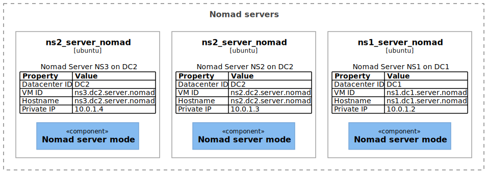
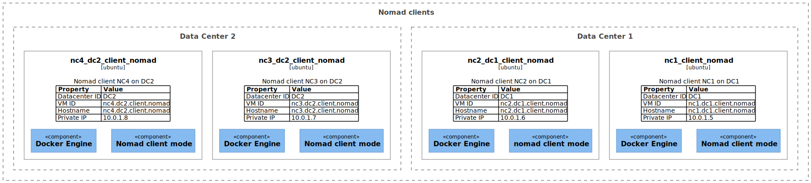

# Test infrastructure

Read (also all sub chapters) to understand:
 * [Vagrant Getting started](https://learn.hashicorp.com/collections/vagrant/getting-started)
 * [Vagrant Mutiple servers](https://www.vagrantup.com/docs/multi-machine)
 * [Vagrant networks](https://www.vagrantup.com/docs/networking)
 * [Helpful example](https://manski.net/2016/09/vagrant-multi-machine-tutorial/)

We will try to simulate a production ready infrastructure. Following, as far as we get without having a enterprise license, the guides on
* [Nomad Reference Architecture](https://learn.hashicorp.com/tutorials/nomad/production-reference-architecture-vm-with-consul?in=nomad/enterprise)
* [Nomad Deployment Guide](https://learn.hashicorp.com/tutorials/nomad/production-deployment-guide-vm-with-consul?in=nomad/enterprise)

Therefore we distinquisch between 3 different types of servers.

## `Jump server`
with the VM ID `nj1.local.jumper.nomad`

From this [jumper server](https://en.wikipedia.org/wiki/Jump_server) we will push our jobs to the nomad server nodes.

## `Nomad server`
with the VM ID's `ns[1,2,3].dc[1,2].server.nomad`

Those `nomad servers` will allocate the jobs we will give them to the best fitting clients.

### `Nomad clients` with the VM ID's `cs[1,2,3,4].dc[1,2].client.nomad`

`Nomad clients` are the nodes where the `jobs` allocated on.

## Components

As seen above we need in addition to the VM itself several components e.g. Nomad, Docker and later maybe Consul.

It may makes no sense to use `Ansible` here to provision the VM's. But if its fully automated it can't be that bad, right? Or I just suck so hard at Ruby and Shell scripts that I rather overkill this. Maybe we can reuse it later anyways.

 - [ ] TODO install ansible
 - [ ] TODO create static inventory
 - [ ] TODO create groups for node server and node client
